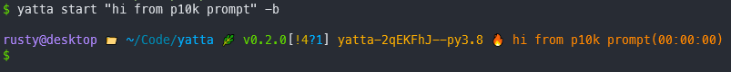

[](https://github.com/rhroberts/yatta/actions?workflow=Tests)
[](https://codecov.io/gh/rhroberts/yatta)
[](https://pypi.org/project/yatta/)
[](https://github.com/rhroberts/yatta)
[](https://github.com/psf/black)

# yatta

yatta is yet another time tracking app.
It is a basic stopwatch-style time tracker that stores task information and provides some reporting.
Inspired by [termdown](https://github.com/trehn/termdown),
[timetrack](https://www.flathub.org/apps/details/net.danigm.timetrack),
[timewarrior](https://timewarrior.net/). It is not yet very stable.

[](https://asciinema.org/a/MZ8Vajjhhhrt9fHEZfao3VFVQ)

## Installation

```bash
pip install yatta
```

## Development

- [Install poetry](https://python-poetry.org/docs/#installation)
- Get source and install dependencies

  ```bash
  git clone https://github.com/rhroberts/yatta
  cd yatta
  poetry install
  ```

- Open a shell within the poetry-managed virtual environment: `poetry shell`

Alternatively, you can manually install the dependencies in [pyproject.toml](https://github.com/rhroberts/yatta/blob/master/pyproject.toml) and use the development environment of your choice.

### Planned Features

- **v1.0.0**
  - WebDAV sync ([#5](https://github.com/rhroberts/yatta/issues/5))
  - Optional web front-end
  - Calendar-like plots

## Usage

There are two main components of yatta: task and records. Tasks are what you track.
They are unique and reusable. Information about tracked tasks are stored as records.
yatta uses [`click`](https://click.palletsprojects.com/en/7.x/) for its command line
interface, so all commands and subcommands provide some basic usage info:

```bash
yatta -h
yatta [COMMAND] -h
```

The below examples are also provided to help get you going.

### Starting and stopping tasks

```bash
yatta start "Write README.md"  # start a stopwatch to track the task "Write README.md"
yatta start "Write README.md" -b  # start stopwatch in background, without fancy ASCII clock
```

Running `yatta stop` from any local shell (that has yatta installed) will stop the task,
regardless of whether or not the task is being run in the background.
If you're using the ASCII stopwatch, you can also hit the "q" key to stop the task when
the shell with the stopwatch is focused.

### List tasks and records

```bash
yatta list tasks  # list all tasks
yatta list tasks "Write README.md"  # show info for task "Write README.md"
yatta list records  # list recent records
yatta list records -t "Write README.md"  # list records for the task "Write README.md"
yatta list records -t 12  # list records for task with id=12
```

### Edit tasks and records

```bash
yatta edit tasks "Write README.md" # edit info about the "Write README.md" task in default $EDITOR
yatta edit tasks 8 -d "water the plants"  # add a description to task with id=8
```

### Delete tasks and records

```bash
yatta delete tasks plants  # remove task "plants" and all its records from database
yatta delete tasks 7  # remove task with task_id=7 and all its records from database
yatta delete records 40  # remove record with record_id=40 from the database
```

### Plotting

```bash
yatta plot  # show bar plot of weekly task durations
yatta plot -d  # show bar plot of daily task durations
yatta plot -m  # show bar plot of monthly task durations
yatta plot -c 100  # weekly bar plot using 100 terminal columns (default=75)
yatta plot -s "last week" # last week's bar plot
```

### Show your timesheet

```bash
yatta timesheet  # show this week's timesheet
yatta timesheet -s "last week"  # show last week's timesheet
yatta timesheet -ds  "two tuesdays ago" # show timesheet from tuesday before last
```

### Manage yatta settings

The settings for yatta live in a toml file in the user's default config dir,
e.g. `~/.config/yatta/settings.toml`. It is recommended to change these settings
through the `config` command, rather than editing them directly.

```bash
yatta config list  # show user settings
yatta config list -d  # show default settings
yatta config background true  # always run yatta in background
yatta config show-legend false  # Don't show legend when plotting
```

#### Tab completions

Tab completions make yatta much easier to use. Beyond the standard completions
available to all `click` applications, yatta provides a few custom completions that
make it even friendlier. For example, since tasks are reusable -- and you probably
do not want to type out `yatta start "my very long task name"` or look up the task ID
with `yatta task list` every time you want to start a task -- yatta can tab complete
from your task list. `yatta start <TAB>` will show all tasks that you've previously
tracked. You can winnow down this list by entering a few characters before hitting tab.

To automatically generate a tab completion file for `bash`, `zsh`, or `fish`:

```bash
yatta config completions -s [bash|zsh|fish]
```

A completion script will be stored in your cache directory, which you can then source
from your shell's config file or move to a designated completions folder, depending on
the shell you are using. The stdout of the completion command will try to give you a
hint for this.

#### Configure shell prompt to show yatta status

It can be helpful to show information about yatta in your shell prompt. This makes it easier to
remember that you are currently tracking a test. To help with this, yatta writes the
status of a running task to a temporary file in the user cache directory. Here's an example of how to
use this file to display task information using the
[`powerline10k`](https://github.com/romkatv/powerlevel10k) zsh theme:

In `~/.p10k.zsh`...

```zsh
# The list of segments shown on the left. Fill it with the most important segments.
typeset -g POWERLEVEL9K_LEFT_PROMPT_ELEMENTS=(
  # =========================[ Line #1 ]=========================
  context                 # user@hostname
  dir                     # current directory
  vcs                     # git status
  pyenv                   # python environment (https://github.com/pyenv/pyenv)
  virtualenv              # python virtual environment (https://docs.python.org/3/library/venv.html)
  nvm                     # node.js version from nvm (https://github.com/nvm-sh/nvm)
  node_version            # node.js version
  yatta                   # yatta active task info
)

...

# custom prompt segment to show time tracking status for yatta
function prompt_yatta() {
  yatta_file=$HOME/.cache/yatta/active_task
  if [[ ! -a $yatta_file ]]; then
    return
  else
    string=$(cat $yatta_file)
    arr=(${(f)string})
    p10k segment -f 208 -i '🔥' -t ${arr[4]}'('${arr[5]}')'
  fi
}
```



